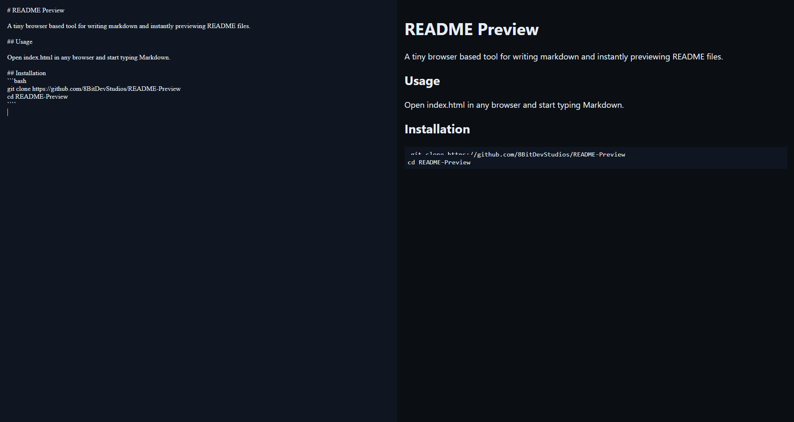

# README Preview

A tiny browser based tool for writing markdown and instantly previewing README files.



## Usage

Open index.html in any browser and start typing Markdown.

## Installation
```bash
git clone https://github.com/8BitDevStudios/README-Preview
cd README-Preview
````
